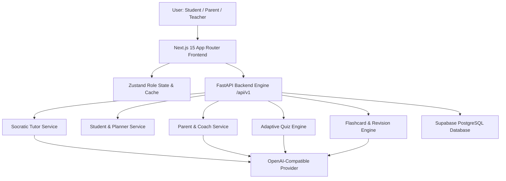

# Phase 3 – Student & Parent AI Learning Ecosystem Architecture

## Overview
Phase 3 extends Academix AI into a multi-role learning platform, featuring:
- **Student Portal**: Duolingo + Khan Academy + ChatGPT + Notion hybrid learning environment.
- **Parent Portal**: Complete visibility into homework, attendance, study metrics, and AI Parenting Coach.
- **Socratic AI Tutor**: Active-recall homework assistant that guides students without revealing answers directly.
- **Gamification Engine**: XP points, daily streak flames, levels, study badges, and class/school leaderboards.

## Key Modules
1. `SocraticTutorService`: Generates non-spoiler hints, guided questions, and conceptual breakdowns.
2. `QuizService`: Creates adaptive quizzes across 9 question types (MCQs, Short/Long, Case Studies, Reasoning, Assertion & Reason, Fill-in-blanks, Matching, True/False).
3. `RevisionService`: Generates Spaced Repetition Flashcards, Mind Maps, Formula Sheets, Cheat Sheets, and Exam Prep suites.
4. `ParentService`: Supplies child analytics, parent notification feeds, and evidence-based AI parenting guidance.
